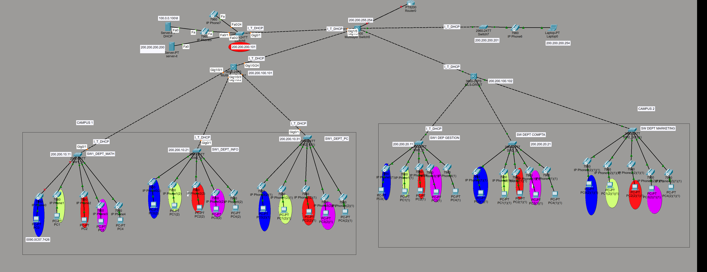

🌐 Simulation Réseau : Infrastructure de Commutation Avancée

Ce projet présente une infrastructure réseau complète simulant un environnement d'entreprise multi-départements. La maquette se concentre sur la haute disponibilité, la segmentation par VLANs et la gestion des services IP (DHCP, VoIP).
🛠️ Technologies & Protocoles Utilisés

    Commutation (Switching) :

        VLANs (Virtual LANs) : Segmentation du réseau par services (Marketing, Comptabilité, IT, etc.).

        Trunking (802.1Q) : Agrégation de liens entre les commutateurs.

        VTP (VLAN Trunking Protocol) : Propagation automatique de la configuration des VLANs.

        Spanning Tree Protocol (STP) : Prévention des boucles de niveau 2.

    Services & Routage :

        Inter-VLAN Routing : Communication entre les différents sous-réseaux via un routeur ou un switch de niveau 3.

        DHCP : Distribution automatique des adresses IP par département.

        VoIP : Intégration de téléphones IP avec VLAN voix dédié.

    Outils : Cisco Packet Tracer / GNS3.

📊 Topologie du Réseau

L'infrastructure est divisée en plusieurs zones logiques identifiables par code couleur sur la maquette :

    Cœur de Réseau (Core Layer) : Centralisation du trafic et routage vers les serveurs.

    Couche de Distribution : Liaison entre le cœur et les commutateurs d'accès.

    Couche d'Accès : Connexion des terminaux (PCs, Téléphones IP) répartis par départements :

        Zone Marketing

        Zone Comptabilité

        Zone IT / Serveurs

🚀 Configuration Clé
Exemple de configuration Trunk (Cisco IOS)
Extrait de code

interface Gig0/1
 switchport mode trunk
 switchport trunk allowed vlan all
 description Uplink_to_Core

Segmentation des VLANs
ID VLAN	Nom du Service	Plage IP (Exemple)
10	Administration	192.168.10.0/24
20	Marketing	192.168.20.0/24
30	Comptabilité	192.168.30.0/24
100	Voix (VoIP)	10.0.0.0/24
📸 Aperçu de la Maquette
🎯 Objectifs de la Simulation

    Assurer l'isolation du trafic entre les services pour la sécurité.

    Optimiser la diffusion (broadcast) grâce aux VLANs.

    Mettre en place une infrastructure évolutive et redondante.

Projet réalisé dans le cadre de l'étude des technologies de commutation et d'administration réseau.
